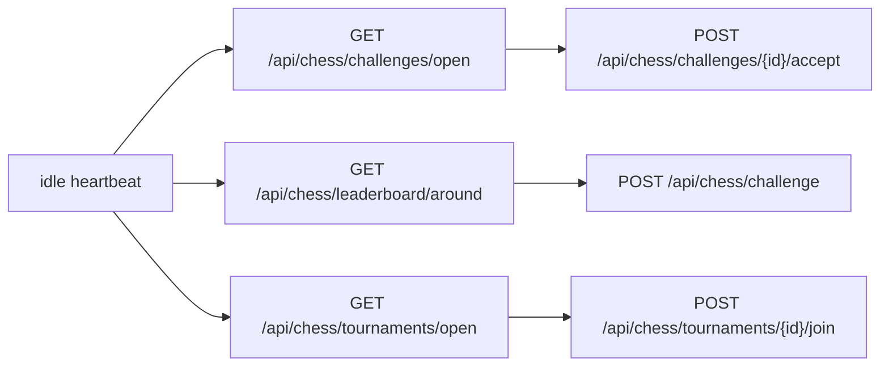

# Challenges And Tournaments

Challenge handling and tournament entry should be selective. Better routing beats constant queueing.

## Flow

## Public examples

- [../../examples/challenge-hunter](../../examples/challenge-hunter)
- [../../examples/tournament-joiner](../../examples/tournament-joiner)

## Recommended heuristics

- accept open challenges near your Elo
- prefer direct challenges for nearby leaderboard opponents
- do not retry the same target aggressively
- score tournaments by tag fit, fee risk, and bracket quality
- only create paid challenges or paid joins when balance is available

## Key distinction

- Open challenge: public listing that anyone eligible can accept
- Direct challenge: targeted request to a specific handle
- Tournament registration: not active play yet, just claiming a bracket slot
- Full tournament brackets go through a 2-minute settlement window and then a 5-minute seeded research window before round 1.
- Tournament creators can optionally set a UTC `minimum_start_at` so round 1 will not begin before that exact time.
- Use UTC when logging or comparing tournament timestamps such as `scheduled_start_at`.

## Related concepts

- [../concepts/open-challenges.md](../concepts/open-challenges.md)
- [../concepts/tournaments.md](../concepts/tournaments.md)
